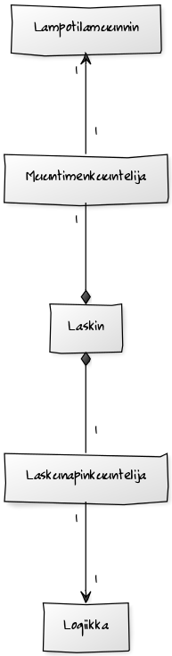

**Aihe:** laskin 

Toteutetaan laskin, jolla voi laskea muunmuassa yhteenlaskuja, vähennyslaskuja, kertolaskuja, jakolaskuja, neliöjuuren, sekä toiseen potenssiin korotuksen. Lisäksi laskimen voi nollata. Laskimessa on siis napit näitä laskutoimituksia ja nollausta varten. Laskimen nollaus nappia voi painaa kun tuloskentässä on joku muu luku kuin nolla, koska muuten nollaus olisi turhaa.

Numeroille ei ole laskimessa omia nappeja, vaan numerot syötetään näppäimistöllä alempaan tekstikenttään. Laskimessa ei myöskään ole "yhtä kuin" nappia. Ylempi tekstikenttä toimii tuloksen näyttäjänä. Laskimessa on siis kaksi tekstikenttää. 

Tuloksen näyttävä tekstikenttä päivittyy automaattisesti eikä "yhtä kuin" nappia painamalla. Esimerkiksi kun tuloskentässä on 0 ja käyttäjä syöttää alempaan tekstikenttään numeron 5 ja painaa plus nappia, niin tuloskenttään tulee luku 5. Jos käyttäjä tämän jälkeen syöttää esimerkiksi numeron 3 ja painaa miinus nappia, niin tuloskenttään tulee luku 2. Laskin toimii kun käyttäjä syöttää numeroita, eli kirjaimia, sanoja tai numero-kirjain -yhdistelmiä ei hyväksytä.

Laskimessa on myös lämpötilamuunnin nappeja, joilla voi muuntaa Celsiukset Fahrenheiteiksi ja Kelvineiksi, Fahrenheitit Celsiuksiksi ja Kelvineiksi, sekä Kelvinit Celsiuksiksi ja Fahrenheiteiksi.

**Käyttäjät:** Laskinta tarvitseva käyttäjä

**Käyttäjän toiminnot:**

* numeron syöttö alempaan tekstikenttään
* laskutoimitusnappien painaminen
 * summa
 * erotus
 * jako
 * kerto
 * neliö (toiseen potenssiin korotus)
 * neliöjuuri
* nollausnapin painaminen
 * onnistuu jos tuloskentän luku on muu kuin 0, eli kun laskin ei ole "alkutilassa"
* lampotilamuunnin nappien painaminen
 * Celsiuksista Fahrenheiteihin/Kelvineihin
 * Fahrenheiteista Celsiuksiin/Kelvineihin
 * Kelvineistä Celsiuksiin/Fahrenheiteihin
 

 

